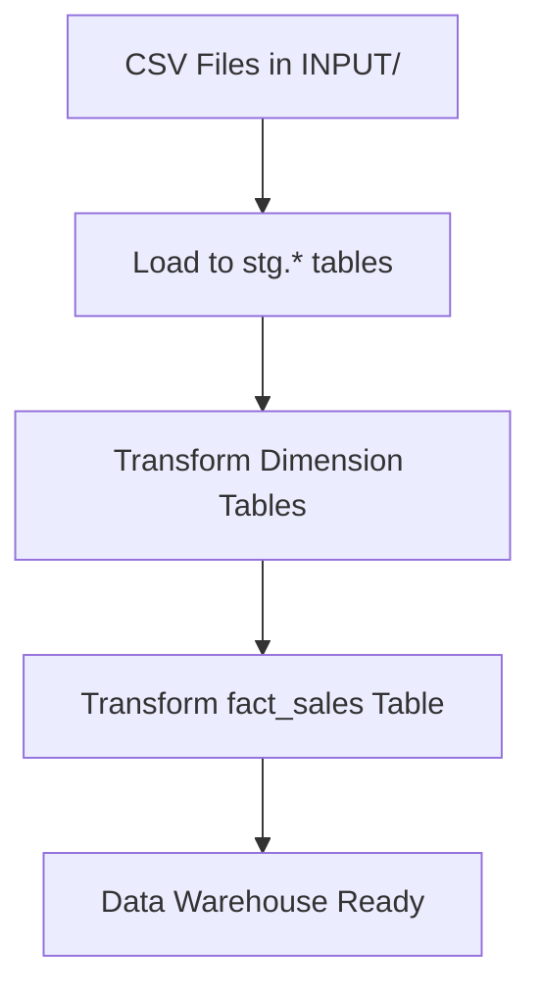

# 🚀 ETL Pipeline to Data Warehouse with Apache Airflow

[](https://airflow.apache.org/)
[](https://www.postgresql.org/)


## 🔍 Project Overview

This project showcases a modular ETL pipeline using **Apache Airflow** and **PostgreSQL** to automate the process of loading raw CSV files into a structured Data Warehouse. It simulates a real-world scenario where transactional data is ingested, staged, transformed, and modeled for analytical querying using a star schema.

---

## 🎯 Objectives

* Automate ingestion of multi-source, multi-delimiter CSV data
* Normalize and stage raw data into `stg.*` tables
* Transform staged data into dimension and fact tables
* Follow star schema modeling for reporting and analysis
* Modularize SQL logic using Python and Airflow

---

## 🗺️ ETL Flow Diagram



---

## 🧩 Data Modeling (Star Schema)

The project implements a **Star Schema** data model:

* **1 Fact Table**: `fact_sales` (sales transactions)
* **4 Dimension Tables**: `dim_customer`, `dim_product`, `dim_employee`, `dim_time`

```plaintext
             dim_customer
                  ▲
                  |
             fact_sales ◄──── dim_product
                  ▲
                  |
           dim_employee      dim_time
```

### Fact Table: `fact_sales`

| Column         | Type    | Description          |
| -------------- | ------- | -------------------- |
| `sales_id`     | INT     | Primary Key          |
| `customer_id`  | INT     | FK to `dim_customer` |
| `product_id`   | INT     | FK to `dim_product`  |
| `employee_id`  | INT     | FK to `dim_employee` |
| `time_id`      | DATE    | FK to `dim_time`     |
| `quantity`     | INT     | Units sold           |
| `price`        | NUMERIC | Unit price           |
| `total_amount` | NUMERIC | quantity \* price    |

### Dimension Tables

* **`dim_customer`**: customer info (name, gender, city, country)
* **`dim_product`**: product info (name, category, price)
* **`dim_employee`**: employee info (name, location, hire date)
* **`dim_time`**: time breakdown (day, month, year, quarter)

---

## 🛠️ Airflow DAG Overview

* **File**: `etl_to_data_warehouse.py`
* **Schedule**: Manual trigger (`schedule_interval=None`)
* **Components**:

  * `PythonOperator`: to truncate and load staging tables
  * `SQLExecuteQueryOperator`: to run transformation queries
  * `TaskGroup`: to group dimension and fact transformations
* **Dynamic Execution**: Loops over multiple input dates and tables

```plaintext
start
 └─► truncate_table
     └─► load_to_staging
         └─► transform_dimensions
             └─► transform_fact
                 └─► end
```

---

## ✅ Conclusion

This ETL pipeline project demonstrates a complete data engineering workflow using Airflow and PostgreSQL:

* Ingestion from real-world flat files
* Structured transformation logic
* Reusable and scalable DAG components
* Star schema implementation for downstream analytics

It serves as a solid foundation for anyone building batch data pipelines, and can be extended with validation, alerting, or data quality checks for production use.

---

Feel free to explore, fork, or adapt this project for your own learning or production environments!
